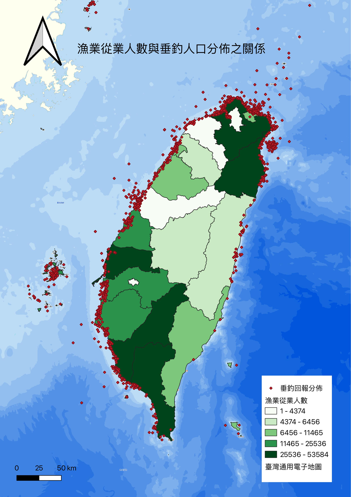

# 2022年漁業從業人數與垂釣人口分佈之關係

## 內容呈現
漁業資源豐富的地區可能會吸引更多的垂釣愛好者，而垂釣活動的增加也可能促進當地漁業產業的發展，從而形成一個互相促進的經濟循環。通過這樣的分析，我們可以更好地理解漁業從業人數與垂釣人口分佈之間的關係，並針對不同地區制定相應的漁業發展和休閒漁業推廣策略。

## 使用資料
+ [政府開放資料平台：iOcean垂釣回報（CSV）](https://data.gov.tw/dataset/157622)
+ [政府開放資料平台：漁業署_每年漁業從業人數統計資料（CSV）](https://data.gov.tw/dataset/135731)
+ [直轄市、縣市界線 TWD97經緯度（SHP）](https://data.gov.tw/dataset/7442)

## 詳細工作
1. 底圖使用臺灣通用電子地圖
2. 匯入縣市界SHP檔
3. 將各縣市2022年之漁業從業人數總計資料，加入縣市界 attribute 進行資料結合
4. 用 symbology 進行 classify 以後呈現結果
5. 將2022年之垂釣人口分佈座標加入圖層
6. 用 layout manager 加入地圖
7. 再加入指北針、圖例、比例尺、圖名
8. 匯出 jpg 檔的地圖

## 結果呈現

## 分析
+ 南投縣不靠海，卻存在漁業從事人口，可能與日月潭的漁業資源有所相關。
+ 台中垂釣人口密集，從事漁業人口卻很少，查看發現台中幾乎沒有人從事養殖、近海、遠洋漁業，大多都是從事沿岸漁業。

## 結論
這張圖表明台灣的漁業從業人數與垂釣人口分佈之間存在明顯的地理相關性。這種地理分佈特徵反映了自然資源、經濟活動和文化習俗對於漁業和垂釣活動的重要影響。