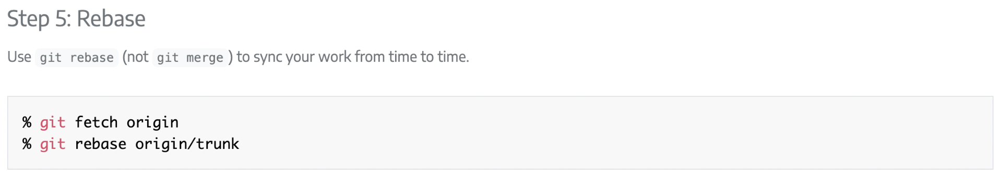

# 開源社群專案作業 - Selenium

Selenium 是一個開源的 Web 驅動程式，用於自動化 Web 應用程式。支持多種瀏覽器和編程語言，廣泛應用於網頁 UI 的自動化測試。

## 貢獻指引網址
>https://www.selenium.dev/documentation/about/contributing/

## Pull Requests 說明網址
>https://www.selenium.dev/documentation/about/contributing/#step-7-push

## 提交 Pull Request 的步驟
1. Fork 一份 Selenium 專案
2. 建立一個分支開始進行修改
3. 把該分支推送到自己的 GitHub 專案。
4. 在 GitHub 上建立一個 Pull Request。
5. 審查完成後，Selenium項目的負責人會將該 Pull Request 合併到主分支。通常會被壓縮並 rebase 以保持線性歷史。

## 簡短閱讀心得
+ 大致理解 merge 和 rebase 的區別。當在 feature 分支上進行開發工作時，使用 rebase 會將修改內容的歷史記錄接在要合併的分支後面，合併後的歷史記錄會比較清楚簡單，因此這邊才會要求使用 rebase 來合併分支。

